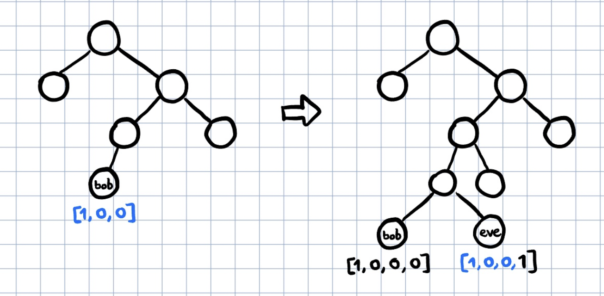

# Turtle Tree Solution

Soluution: Register a username with an index that shares the same first 6 or 7 bits as bob.
The bug was here:

```python
    if (
        bytes_to_bits(bob_ap.lookup_index)[: bob_ap.leaf.level]
        != bytes_to_bits(ap.lookup_index)[: bob_ap.leaf.level]
    ):
        raise ValueError("This authentication path isn't for Bob")
```

Since bob_ap is calculated before your register, `bob_ap.leaf.level` is off-by-one if you register a username that bumps bob's `LeafNode` down the tree.



Then you can give your username to Alice, who will send a ciphertext that you can now decrypt with your private key and Alice's public key.
