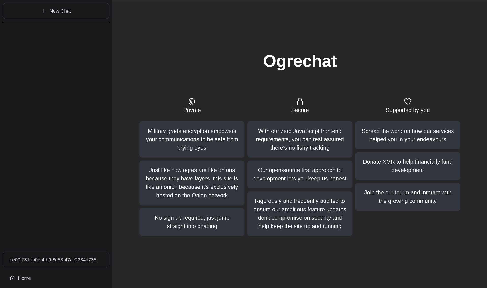

## About

Author: `mbund`

CTF challenge using Tor hidden services. The goal is to find the true IP address of the hidden service.

`web` `easy`

> The tor-only accessible chatting webapp for ogres!

The hidden service is accessible at [ogresogtmou2q5uoh3ctyd4wfc4n3pghyxvf4zyi5fm3ou6u5mdyshid.onion](http://ogresogtmou2q5uoh3ctyd4wfc4n3pghyxvf4zyi5fm3ou6u5mdyshid.onion) (only navigatable using the Tor Browser).

## Maintaining

The key to the vanity domain is in `ogrekeys/ogresogtmou2q5uoh3ctyd4wfc4n3pghyxvf4zyi5fm3ou6u5mdyshid.onion`.

## Solve

Just send a webhook and record the source IP address. The URL preview feature will fetch the resource without going through tor and expose the orginal server.
