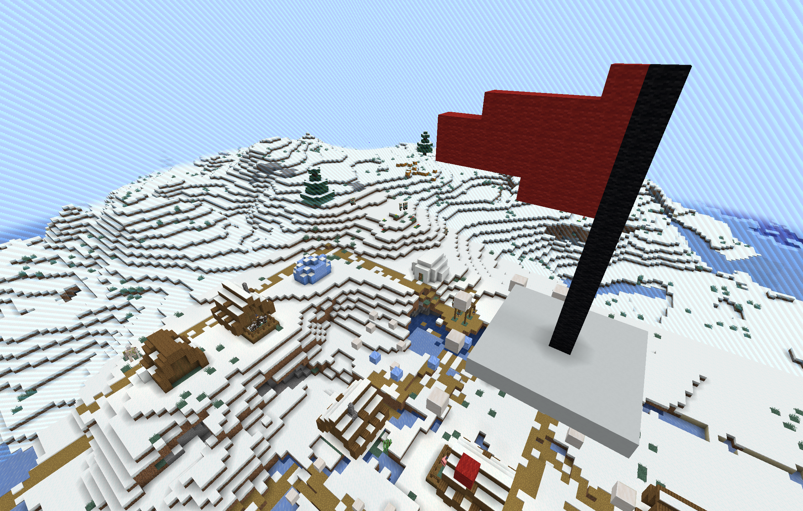

## About



Author: `mbund`

`misc` `easy`

There is a parkour map hosted on a server, at the end of the parkour is a sign with the flag on it.

> Completely unrelated to CTF Minecraft parkour.

## Maintenance

```
docker run -d -it -p 25565:25565 -e EULA=TRUE -e VERSION=1.20.1 -v (pwd)/data:/data itzg/minecraft-server
zip data.zip -r data
docker build . -t parkour
docker run -it -p 25565:25565 parkour
```

## Solve

One of the jumps is impossible. Use freecam, fly hacks, or download the world file. Easiest is free camming with an easily installable [mod](https://curseforge.com/minecraft/mc-mods/free-cam)
