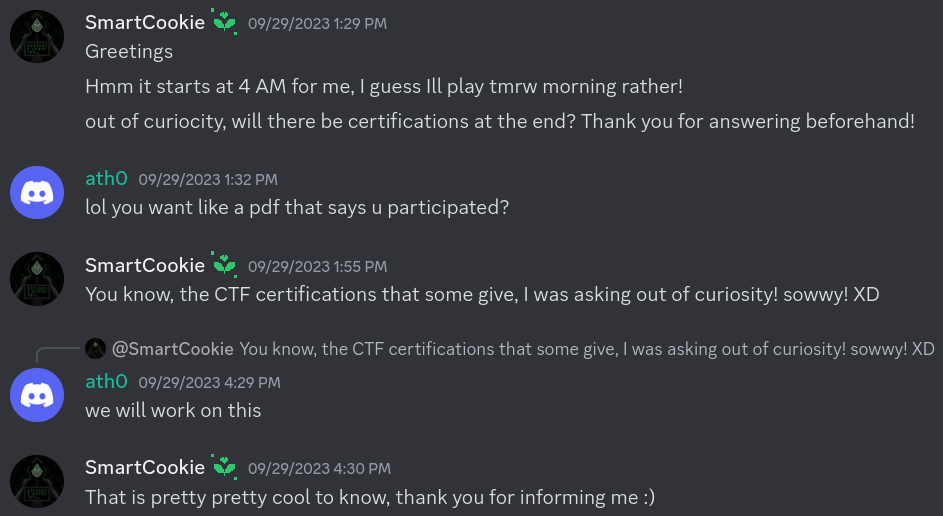
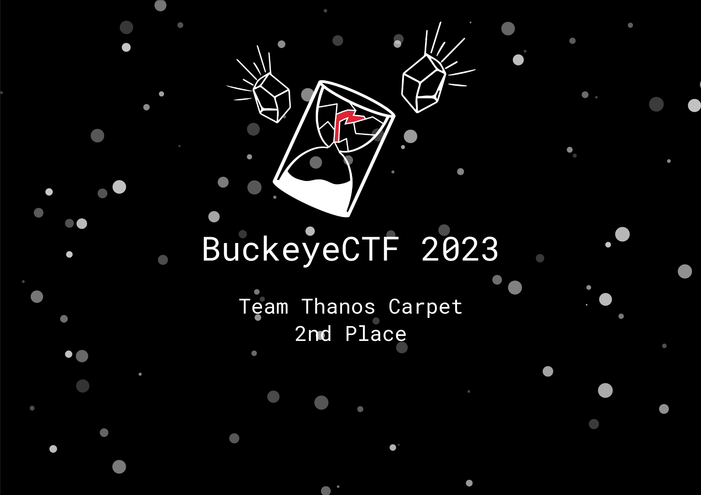

## About




Author: `mbund`

`web` `medium`

JWTs + pdf generation.

> The discord screenshot

## Solve

The server signs an asymetric encryption jwt, but also allows verification with symmetric encryption. So sign a jwt with the public key which makes your team in 1st place and put it in a pdf.

```
bun run solve.tsx
```
