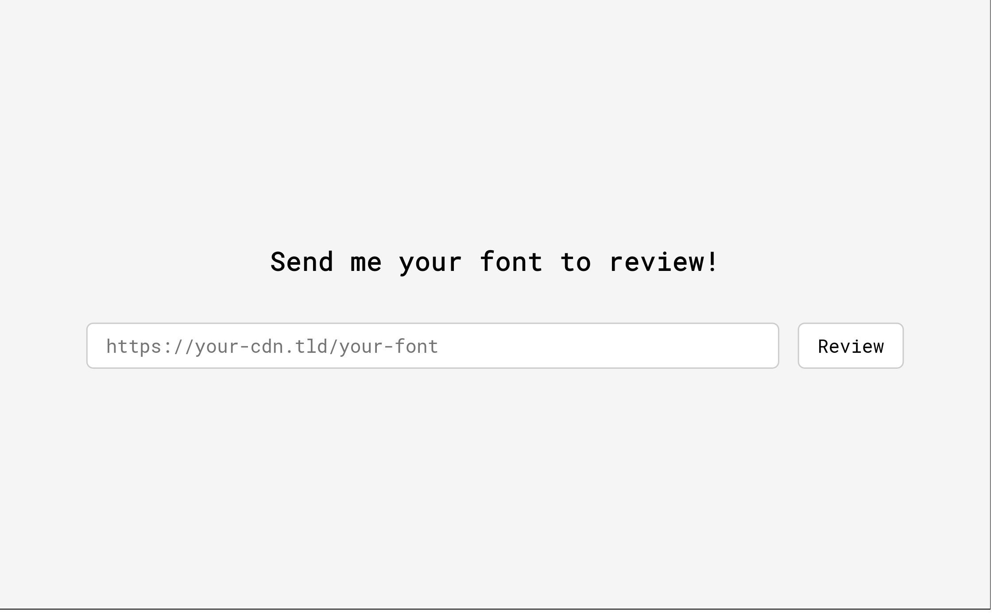

## About



Author: `mbund`

`web` `medium`

Custom font madness

> I'm a graphic designer trying to improve my typography skills. Let me review your font!

## Solve

Go to `solve` and run `python3 solve.py 2> /dev/null`

The site errors if the text goes outside of the window. Create a font with large spacing between the characters such that it just barely errors. Then iterate over fonts which make a ligature out of characters starting with `bctf{` through to the flag, and condense it into a single character of width `0` such that the page succeeds.

The following typescript can be added to help with debugging. Watch the output screenshot as your script is running.

```typescript
await page.screenshot({ path: "page.png" });
```
