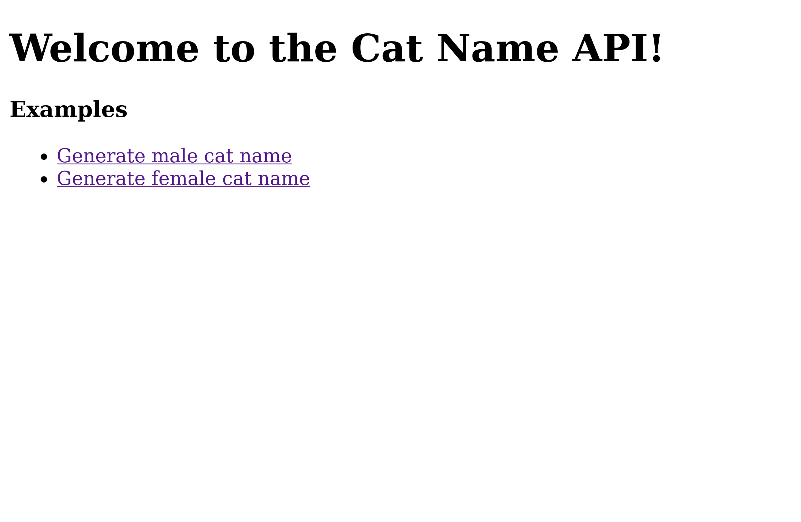

## About



Author: `mbund`

Javascript/express shenanigans with path traversal. Strings and arrays have a number of methods called the same thing.

`web` `easy`

> Stuck on what to name your stray cat?

## Name

A portmanteau of `string` and `array`.

## Solve

Express has a special syntax for handling query parameters that are arrays. For example, the query parameter `category[]=cats&category[]=dogs` will be parsed into the array `['cats', 'dogs']`. You can then construct a path traversal attack by bypassing the length check with an array with a single element.

```
http://localhost:3000/cat?category[]=../flag.txt
```
