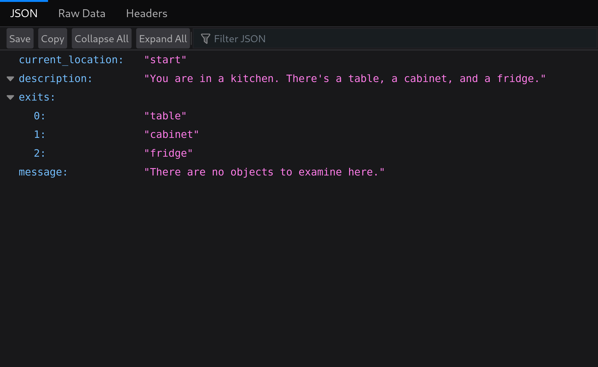

## About

Author: `mbund`

Python pkls do arbitrary code execution and are very unsafe to load.

`web` `easy`

> Tour my kitchen!

## Solve

Use `solve.py` to generate a `solve.pkl` file which just runs a command. It webhooks the flag to the user.
